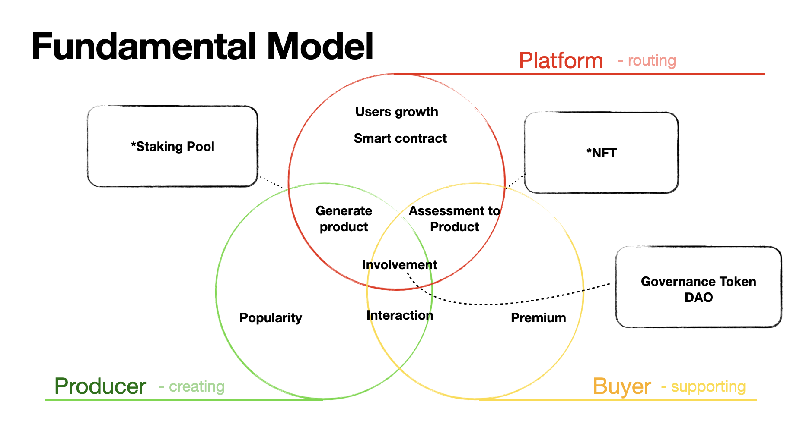

#  Model for SAAS Platform

## Basic Concept

Most current SAAS platform, namely Uber, airBnb..etc, could possibly leverage on blockchain technology somehow to build healthier and more efficient business model

The concept is still on working and imperfect; however, this shabby model is fundamental and generic enough to explain most SAAS company cases willing to step into web3 world and leveraging on the blockchain technology.

Full and detailed information is available at my [medium](https://medium.com/@jarekcoding/tokenomic-model-for-saas-platform-89b5828a27ec) articles, it is unsurprising following articles will be released. Stay tuned.

 _Note:_ This model is highly inspired by [Spl_program_governance](https://github.com/solana-labs/solana-program-library)   
 

